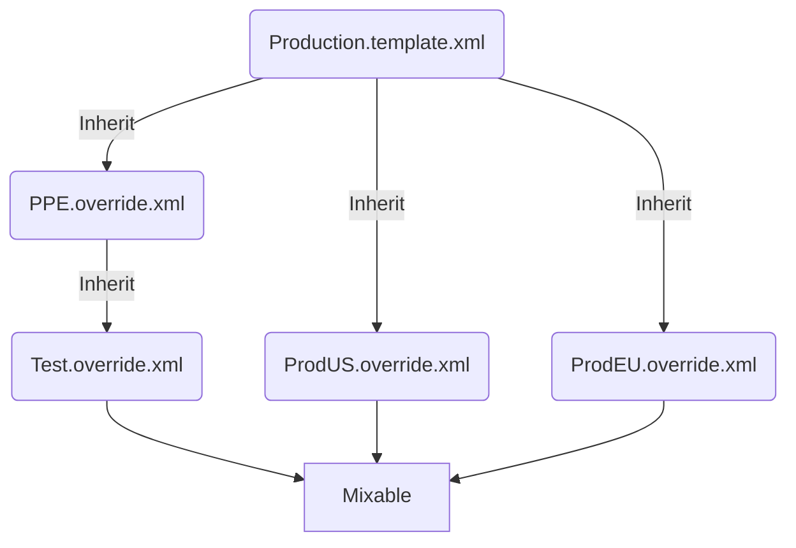

# 🇲🅘🇽🅐🅑🇱🅔

Mixable hopes to make service configuration easier. Mixable allows...

- Inferring XML schemas from XML documents, with limited required metadata. No need for XSD files!
- Chaining overrides of XML files in a validated, schematized way to produce derived, environment-specific configurations
- Generating XML parsers for those schemas in a variety of languages

### Config Merge:

Mixable allows you to define your configuration in a way that makes sense. You start with a template file that might have some useful default settings applicable everywhere. Derived files then reference this template, overriding (but not extending) the structure.



### Examples

```xml
<!-- this is the template file -->
<Settings xmlns:mx="http://mixable">
  <mx:Metadata>
    <NamespaceName>MyService.Configuration</NamespaceName>
    <GenerateCSharp>true</GenerateCSharp>
  </mx:Metdata>
  
  <!-- Mixable sees that this is a map of named items: Port : int, Thumbprint : string -->
  <HttpListener>
    <Port>443</Port>
    <CertificateThumbprint>ABCDEF</CertificateThumbprint>
  </HttpListener>
  
  <!-- Mixable infers this to be a list of Map objects, each one having Name and ExpirationTime -->
  <BannedUsers>
    <User>
      <Name>Petunia</Name>
      <Expiration>3/14/2022</Expiration>
    </User>
    <User>
      <Name>Pudge</Name>
      <Expiration>1/27/2015</Expiration>
    </User>
  </BannedUsers>
  
  
</Settings>
```
