# 🇲🅘🇽🅐🅑🇱🅔
[](https://github.com/jamescourtney/Mixable/actions/workflows/build.yml) [](https://codecov.io/gh/jamescourtney/Mixable)


Mixable is a build-time tool that makes service configuration easier by allowing you to define your config in a way that makes sense. Simply provide your template and override XML files, and Mixable will validate your overrides, then generate merged XML along with a parser to read the files. This means that adding a new config settings means you only need to update one place, and Mixable does all the work to enlighten your code.

```mermaid
flowchart LR
  subgraph XML ["Input (XML)"]
    direction BT
    ovr("📝A.mxml") -.-> tmp("📝Template.mxml")
    ovr2("📝B.mxml") -.-> tmp
    ovr3("📝C.mxml") -.-> ovr2
  end
  
  subgraph Mixable ["🇲🅘🇽🅐🅑🇱🅔"]
    direction TB
    mv("Validation") --- mm("Merge") --- mc("CodeGen")
  end
  
  subgraph Parsers
    csharp("Parser.cs")
    python("Parser.py")
  end
  
  subgraph Merged ["Merged XML"]
    direction TB
    ovr3merged("📝C.Merged.xml")
    ovr1merged("📝A.Merged.xml")
  end
  
  XML --> Mixable --> Parsers & Merged
  
  linkStyle 3 stroke-width:0px;
  linkStyle 4 stroke-width:0px;
```



## Quick Start
Mixable input files end in the `.mxml` file extension. The first step is to define a template:
```xml
<Settings xmlns:mx="https://github.com/jamescourtney/mixable">
  <mx:Metadata>
    <!-- Code is generated based on the template file, not the overrides -->
    <mx:NamespaceName>Some.Namespace</mx:NamespaceName>
    <mx:GenerateCSharp>true</mx:GenerateCSharp>
  </mx:Metadata>
  
  <HttpListener>
    <ListeningPort>443</ListeningPort>
    <TlsCert>myfancydomain.com</TlsCert>
    <RequireAuthentication>true</RequireAuthentication>
  </HttpListener>
  
  <!-- A list of strings -->
  <BlockedUsers>
    <UserId mx:Type="string">1234</UserId>
    <UserId>5678</UserId>
  </BlockedUsers>
</Settings>
```

Then define overrides per environment:
```xml
<Settings xmlns:mx="https://github.com/jamescourtney/mixable">
  <mx:Metadata>
    <mx:BaseFile>Template.mxml</mx:BaseFile>
    <mx:OutputXmlFile>TestConfig.xml</mx:OutputXmlFile>
  </mx:Metadata>
  
  <HttpListener>
    <TlsCert>localhost</TlsCert>
    <RequireAuthentication>false</RequireAuthentication>
  </HttpListener>
  
  <!-- Remove blocked users in test -->
  <BlockedUsers mx:ListMerge="Replace" />
</Settings>
```
###
