# 🇲🅘🇽🅐🅑🇱🅔

Mixable makes service configuration easier by allowing you to define your config in a way that makes sense. Simply provide your template and override XML files, and Mixable will validate your overrides, then generate merged XML and a parser to read the files. This means that adding a new config settings means you only need to update one place, and Mixable does all the work to enlighten your code.

```mermaid
flowchart TD
  subgraph XML ["Input (XML)"]
    direction LR
    ovr("📝Override1.xml") -.-> tmp("📝Template.xml")
    ovr2("📝Override2.xml") -.-> tmp("📝Template.xml")
    ovr3("📝Override3.xml") -.-> ovr2
  end
  
  subgraph Mixable ["🇲🅘🇽🅐🅑🇱🅔"]
    mv("Validation")
    mm("Merge")
    mc("CodeGen")
  end
  
  subgraph Output
    direction TB
    ovr3merged("📝Override3.Merged.xml")
    ovr1merged("📝Override1.Merged.xml")
    code("CodeGen Parser")
  end
  
  XML --> Mixable --> Output
```

