# 🇲🅘🇽🅐🅑🇱🅔
[](https://github.com/jamescourtney/Mixable/actions/workflows/build.yml) [](https://codecov.io/gh/jamescourtney/Mixable)


Mixable is a build-time tool that makes service configuration easier by allowing you to define your config in a way that makes sense. Simply provide your template and override XML files, and Mixable will validate your overrides, then generate merged XML along with a parser to read the files. This means that adding a new config settings means you only need to update one place, and Mixable does all the work to enlighten your code.

```mermaid
flowchart LR
  subgraph XML ["Input (XML)"]
    direction BT
    ovr("📝A.mxml") -.-> tmp("📝Template.mxml")
    ovr2("📝B.mxml") -.-> tmp
    ovr3("📝C.mxml") -.-> ovr2
  end
  
  subgraph Mixable ["🇲🅘🇽🅐🅑🇱🅔"]
    direction TB
    mv("Validation") --- mm("Merge") --- mc("CodeGen")
  end
  
  subgraph Parsers
    csharp("Parser.cs")
    python("Parser.py")
  end
  
  subgraph Merged ["Merged XML"]
    direction TB
    ovr3merged("📝C.Merged.xml")
    ovr1merged("📝A.Merged.xml")
  end
  
  XML --> Mixable --> Parsers & Merged
  
  linkStyle 3 stroke-width:0px;
  linkStyle 4 stroke-width:0px;
```



## Quick Start
Mixable input files end in the `.mxml` file extension. The first step is to define a template:
```xml
<Settings xmlns:mx="https://github.com/jamescourtney/mixable">
  <mx:Metadata>
    <CSharp>
      <Enabled>true</Enabled>
      <NamespaceName>Foo.Bar.Baz.Bat</NamespaceName>
      <OutputFile>Test.cs</OutputFile>
    </CSharp>
    <Python>
      <Enabled>true</Enabled>
      <OutputFile>test.py</OutputFile>
    </Python>
  </mx:Metadata>
  
  <HttpListener>
    <ListeningPort mx:Flags="Final">443</ListeningPort>
    <TlsCert>myfancydomain.com</TlsCert>
    <RequireAuthentication>true</RequireAuthentication>
  </HttpListener>
```

Then define overrides per environment:
```xml
<Settings xmlns:mx="https://github.com/jamescourtney/mixable">
  <mx:Metadata>
    <BaseFile>Template.mxml</BaseFile>
    <MergedXmlFile>LocalHostConfig.xml</MergedXmlFile>
  </mx:Metadata>
  
  <HttpListener>
    <TlsCert>localhost</TlsCert>
    <RequireAuthentication>false</RequireAuthentication>
  </HttpListener>
</Settings>
```
### Other stuff!
Mixable supports some other useful concepts as well:
- `Final` modifier: downstream XML files cannot override the given value
- `Abstract` modidifer: Must be overridden before a merged XML file can be produced
- Lists: with full `concatenate` and `replace` semenatics at override time.

### FAQ

#### Project Status
Mixable is quite new, and in active development. Things might change a lot in a hurry or not at all. The existing tests are quite robust and everything *should* work, but breaking changes might happen without warning.

#### What's Planned?
Support for other languages beyond C# (please help!), a command-line tool, possibly fancier merge semantics like making whole chunks of a document `abstract` or `final`.

#### All the cool kids use YAML/JSON
Mixable needs metadata to work. YAML and JSON simply do not have the expressiveness necessary to properly merge complex documents.

### License
Mixable is licensed under the Apache 2 license.
